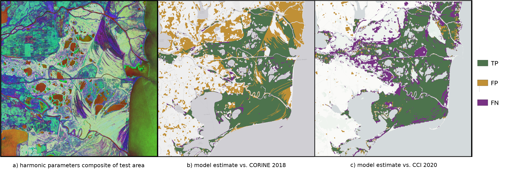

[](https://github.com/c-scale-community/use-case-wetland-water-stress/tree/python-coverage-comment-action-data)

# use-case-wetland-water-stress


With this pipeline we aim to provide users with the ability to train spatiotemporally robust machine learning models to
detect and monitor wetlands and thus assessing their state over time.
Wetlands play a vital role in the ecosystem, but also have critical influence on methane emissions.
Methane is around 25 times as powerful in trapping heat in the atmosphere, but because it does not stay in the
atmosphere as long, it more has a short-term influence on the rate of climate change.
See also
this [news release by NOAA](https://www.noaa.gov/news-release/increase-in-atmospheric-methane-set-another-record-during-2021)
for more details.
Wetlands have been one of the major drivers of methane in the atmosphere, acting as source instead of a sink while not
being stable, including water stress as well as renaturation.

## Installation

Within the python environment of your choice (e.g. _venv_, _conda_, etc.) install the package in editable mode using pip
in the root folder of the project:

```bash
pip install -e .
```

You will also need to install python bindings for _gdal_ for instance using pygdal:

```bash
pip install pygdal=="$(gdal-config --version).*"
```

### Run unit tests

To execute the tests also install test dependencies:

```bash
pip install -e .[test]
```

Use pytest to run the tests:

```bash
pytest tests/
```

Have a look at the GitHub workflow at [.github/workflows/test_coverage.yml](.github/workflows/test_coverage.yml) for an
example on how to install and run tests on a linux machine.

## Data preparation

The training pipeline requires the data to be structured as an [xarray](https://docs.xarray.dev/) _Dataset_
in [Equi7Grid](https://github.com/TUW-GEO/Equi7Grid) projection containing input data and labels. This _Dataset_ should
be stored as [zarr](https://zarr.dev/) archive with appropriate chunk sizes to allow for efficient processing.

### Producing labels

The package contains two helper scripts to produce label masks from CORINE 2018 vector data and CCI Land Cover data. The
masks are stored as a stack of uint8 _GeoTIFFs_ following the [yeoda](https://github.com/TUW-GEO/yeoda) naming
convention as defined in the [geopathfinder](https://github.com/TUW-GEO/geopathfinder) package.

#### CORINE 2018

You can use the _rasterize_shape.py_ script to convert a shape file into a raster tile in
the [Equi7Grid](https://github.com/TUW-GEO/Equi7Grid) projection:

```bash
python rattlinbog/rasterize_shape.py EU020M_E051N015T3 corine_bog_and_marshes.shp rasterized/CORINE_BOG_AND_MARSHES/V1M0R1/
```

The first argument specifies the target _Equi7_ tile to raster the vector data defined in the shapefile passed as the second
parameters to.
The final one defines the output root directory.

Use `python rattlinbog/rasterize_shape.py --help` for more details.

#### CCI Land Cover

The _tile_cci_land_cover.py_ script reprojects the CCI land cover data stored in a NetCDF file to
the [Equi7Grid](https://github.com/TUW-GEO/Equi7Grid) projection and produces a mask from its wetland land cover types (160, 170
and 180).

```bash
rattlinbog/tile_cci_land_cover.py "EU020M_E051N015T3,EU020M_E051N012T3" C3S-LC-L4-LCCS-Map-300m-P1Y-2016-v2.1.1.nc CCI/V1M0R1/EQUI7_EU020M/
```

The first argument is a comma-separated list of _Equi7_ tiles to project the CCI data to.
The second parameter specifies the NetCDF file containing the actual CCI land cover data.
Finally, the last parameter defines the root directory of the datacube.

Use `python rattlinbog/tile_cci_land_cover.py --help` for more details.

### Restructure GeoTIFF stacks

The package provides a restructuring script to put a datacube stored as a stack of _GeoTIFFs_ in the
required [zarr](https://zarr.dev/) format.
The root directory of the input- as well as the label-datacube should follow
the [yeoda](https://github.com/TUW-GEO/yeoda) conventions as defined in
the [geopathfinder](https://github.com/TUW-GEO/geopathfinder) package, i.e.:

```regexp
<ROOT>/SIG0-HPAR/V\dM\dR\d/EQUI7_(AF|AS|EU|NA|OC|SA)020M/E\d\d\dN\d\d\dT\d/
```

For example the [harmonic parameters](https://doi.org/10.48436/x8p2j-1tj74) and
the [CCI Land Cover](https://www.esa-landcover-cci.org/) datasets used to train the Wetland classifier can be
restructured to the required [zarr](https://zarr.dev/) format using the _restructure_data.py_ script:

```bash
python rattlinbog/restructure_data.py EU020M_E051N015T3 SIG0-HPAR/V0M2R1/ CCI/V1M0R1/ hparam/V1M0R1/ restructure_hparams.yml
```

The first argument specifies the _Equi7_ tile that should be restructured.
The second one points to the root directory of the input-datacube, whereas the third argument specified the root
directory of the label-datacube.
Next the root of the output directory is specified, where the [zarr](https://zarr.dev/) archive is stored per _Equi7_
tile.
The final parameter specifies the configration to be used for restructuring.

This config file defines chunk sizes as well as region of interest, and you can filter the data by date.
Have a look at the _restructure\_\*_ example configurations in [templates/configs](templates/configs).

Use `python rattlinbog/restructure_data.py --help` for more details.

### Generate random sample patch indices

Once your data is structured in the expected [zarr](https://zarr.dev/) format, you can use the _sample_data.py_ script to
generate random patch indices which are used for training the wetland model. The sampled patches are balanced between
wetland- and non-wetland-pixels, and this factor is also controlled by the oversampling rate.

```bash
python rattlinbog/sample_data.py hparam/V1M0R1/ samples/V1M0R1/ sampling_unet.yml
```

The first parameter defines the root to the directory containing the [zarr](https://zarr.dev/) archives of the training
data in _Equi7_ tiles.
The second one specifies the output directory where the sample indices will be stored, again
as [zarr](https://zarr.dev/) archive.
Finally, a configuration file is provided specifying patch size, number of samples and oversampling rate.
Have a look at the _sampling_unet.yml_ example configurations in [templates/configs](templates/configs).

Use `python rattlinbog/sample_data.py --help` for more details.

## Model Training

To train the model at scale you can use the _train_cnn.py_ script.

```bash
python rattlinbog/train_cnn.py
```

It just takes as an input a single configuration file describing the training process.
The _parameter_selection_ part describes the root directory where all the training data stored as [zarr](https://zarr.dev/) archives are located, as well as which training data to use by specifying various filters.
The _samples_section_ does the same for the samples indices which can be generated using the _sample_data.py_ script.
Have a look at the _train\_cnn.yml_ example configuration in [templates/configs](templates/configs).

## Examples

You can find examples on how to run experiments with the model on smaller scales using different data, and how to evaluate them by looking at the jupyter notebooks found in [notebooks](notebooks/).

## Dashboard:

https://github.com/orgs/c-scale-community/projects/5
